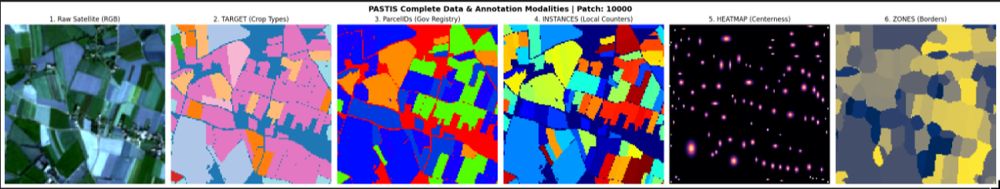

# Pastis

Dataset contains 2,433 unique patches over French metropolitan territory, with 0-19 crop types including void. This dataset split into 5 folds/groups, for each of this fold we have pre-calculated Mean and Std for future scalling. Images are in the form of four dimensional spatio-temporal tensor, example: (43, 10, 128, 128), where 43 is time series counter, in other words - versions of the same territory throughout the year. In one of the sample images we observed over 100 crop fields. Each field in dataset is uniqely identified with 7 digit numbers, but for each fields within image we have dedicated sequential IDs for each field (e.g 0-119). The dataset contains both semantic (pixel level object detection) and instance annotations (object detection and separation from each other).

**DATA_S2** (2,468 files), this folder contains images.     

**ANNOTATIONS** (4,866 files, exactly 2 per image):     
- TARGET_*.npy: The actual Crop Types (Corn, Wheat, Meadow, etc. overall we have 0-19 crop types). This is our training target.
- ParcelIDs_*.npy: The permanent Government Land Registry IDs (7-digit numbers). Which are needed to label each field uniquely.

**INSTANCE_ANNOTATIONS** (7,299 files, exactly 3 per image):        
- INSTANCES_*.npy. Local field counter map (looks like multicolored block). It assigns each pixel in the same field one integer value.       
- HEATMAP_*.npy. A centerness map, pixels in the exact center of a fiels are bright 1.0, and closer they are to the border pixels fade down to dark 0.0. This is necessary for teaching a model to find "heart" of the fields
- ZONES_*.npy. Border tracking map, it categorizes pixels into three zones, 1 for inside the field, 2 exact border/edhe of the field and 0 is outside.

**NORM_S2_patch.json** contains pre-calculated channel statistics (Mean and Standard Deviation) to normilize images properly.

## Example patch

## Workflow
**First** we need to build a Pytorch dataset that will handle three main things:        
1. Fold filtering, which is basically separating 5 patches, so that we can train our model on 1-4 folds and evaluate on fold 5.
2. Read the mean and standart deviation vectors from .json metadata for each fold and normilize patches to 0-1.
3. We need to deal with different time dimensions of each patch in the dataset. Solution is to apply dynamic batch padding, we are going to implement a function called collate_fn, which takes a certain amount of batches/images finds a local maximum (the highest time series number among 4 or 8 batches) and then alligns the rest of the images' time series values to it. Here is exactly how it works:
    - It sees the batch has lengths: [43, 50, 61, 38].

    - It identifies the local maximum (T_max = 61).

    - It takes the tensor with 43 dates, and glues 18 frames of pure zeros to the end of it so its length becomes 61. It does this for all shorter images.

    - It creates a secondary array called a Mask. The mask is filled with 1 for the real data, and 0 for the fake zero-padding. My model will use this mask later to ignore the zeros.

**Second** we need to deal with class imbalance in the dataset, because if you look at the dataset documentation table, classes like Meadow (31,292 fields) and Void Labels (35,924 fields) completely dominate rare crops like Potatoes (551 fields).